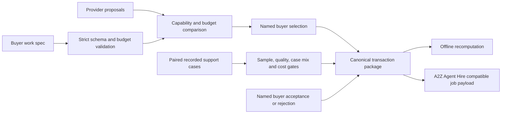

# A2Z Implementation Exchange

An inspectable, offline reference for buying and accepting a **scoped AI customer-support implementation**. A buyer defines the outcome and budget; delivery proposals are checked against explicit requirements; a named buyer chooses an eligible proposal; paired recorded cases are evaluated; and the buyer records an acceptance or rejection. The resulting JSON can be recomputed offline.

**Status:** v0.1 synthetic reference implementation. The bundled providers, buyer, cases, bids, and acceptance are invented. It does not contact providers, deploy agents, authenticate people or source systems, handle payments, or validate production safety. It is a working transaction protocol, not a live marketplace.

This project sits between [A2Z Agent Hire](https://github.com/AAH20/a2z-agent-hire), which has an OSS job and worker contract, and [Outcome Fabric](https://github.com/AAH20/outcome-fabric), which has OutcomeBench and an Evidence Bridge for recorded support exports. This repo emits a payload compatible with A2Z Agent Hire's `create_job` input, with zero-valued **unmeasured cost placeholders** instead of inheriting its synthetic cost defaults. Its built-in evaluator uses transparent paired-case arithmetic; it **does not call OutcomeBench** in this release. A verified OutcomeBench adapter is the next integration milestone.

## Run the transaction

Requires Python 3.10+; runtime has no third-party dependencies.

```bash
PYTHONPATH=src python3 -m implementation_exchange.cli demo
PYTHONPATH=src python3 -m implementation_exchange.cli verify generated/support-transaction.json
PYTHONPATH=src python3 -m unittest discover -s tests -v
```

To use your own **synthetic** inputs:

```bash
PYTHONPATH=src python3 -m implementation_exchange.cli build \
  examples/spec.json examples/proposals.json examples/selection.json \
  examples/cases.json examples/decision.json \
  --output generated/my-transaction.json
```

The five JSON inputs are intentionally separate so the buyer request, proposals, choice, recorded cases, and final decision can be reviewed independently. The `verify` command recomputes every derived field and rejects edits to the score, ranking, economics, or digest. The checksum detects changes relative to the bundled inputs; it is **not** a signature or proof that those inputs came from a real customer.

## The first use case

The bundled request has a $5,000 **illustrative budget** and three required capabilities: support workflow, evaluation, and handoff. Proposal A bids $3,200 and has all capabilities; proposal B bids $2,500 but lacks handoff. The synthetic buyer selects A. Forty invented case IDs appear in each arm. The baseline has 32 accepted cases at $28 per case ($35.00 per accepted case). The candidate has 36 accepted at $22 per case ($24.44 per accepted case). Both arms reach the 30-case floor; the candidate reaches the 80% quality floor and $30 cost ceiling. The buyer then records an invented acceptance.

The $1,800 difference between budget and bid is **unallocated budget, not gross profit**. The exchange has no customer payment or provider payout in the demo, so realized revenue and profit are zero. The case costs are modeled values and do not include implementation, acquisition, support, tax, payment fees, or rework. The public fixture is not resistant to gaming and does not support a causal savings or deployment claim.

## Architecture



For the full OSS and prospective commercial architecture, see [Architecture](docs/ARCHITECTURE.md). For the production path, see [Release gates](docs/PRODUCTION_PATH.md).

## Contract and boundaries

| Component | Today | Next gate |
| --- | --- | --- |
| Work specification | Strict JSON; USD support workload only | Authenticated buyer, versioned changes, jurisdiction-aware terms |
| Proposal comparison | Explicit capabilities, budget, delivery days; no opaque rank score | Verified provider qualifications, conflict checks, capacity and service levels |
| Selection | Buyer name and reason are required text | Identity, authority, signature and audit trail |
| Evaluation | Paired synthetic records; deterministic arithmetic | OutcomeBench adapter over customer-authorized recorded exports; independent review |
| Acceptance | Cannot accept with failed gates | Contractual sign-off, dispute and rework process |
| A2Z Agent Hire | Compatible job JSON in package | Consented API handoff with idempotency and status reconciliation |
| Commercial services | None | Managed implementation, qualified partner network, secure connectors, support and billing |

The acceptance decision is a **business action**, separate from benchmark gates. The gates may pass while a buyer rejects the implementation; a buyer cannot accept through this reference package when a gate fails. The comparison is deterministic and human-selected. No agent chooses a provider or authorizes spend.

## Repository map

- `src/implementation_exchange/core.py` — validation, comparison, paired-case evaluation, transaction and offline verifier.
- `src/implementation_exchange/cli.py` — demo, build and verify commands.
- `examples/` — synthetic, reviewable five-part transaction; `generate_cases.py` recreates the case fixture.
- `tests/` — acceptance, rejection, tampering and malformed-input checks.
- `docs/` — architecture and production release criteria.

## Security and responsible use

Do not put customer data, identity documents, API keys, or unredacted support transcripts in a public transaction file. This runtime is local and has no network code. Do not treat its buyer labels or provider labels as authenticated identities. In production, isolate customer data, verify provenance and authority, encrypt sensitive records, control retention, and require contractual consent before sharing any output. Report security issues privately rather than opening a public issue with sensitive data.

Apache-2.0 licensed. Contributions should preserve the synthetic/demo labels and add tests for any new claim or acceptance gate.
