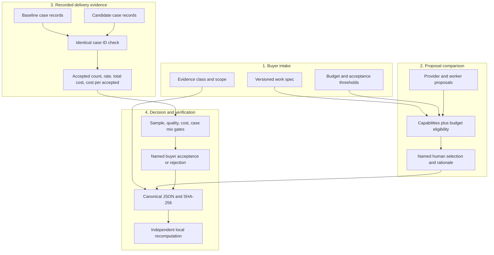
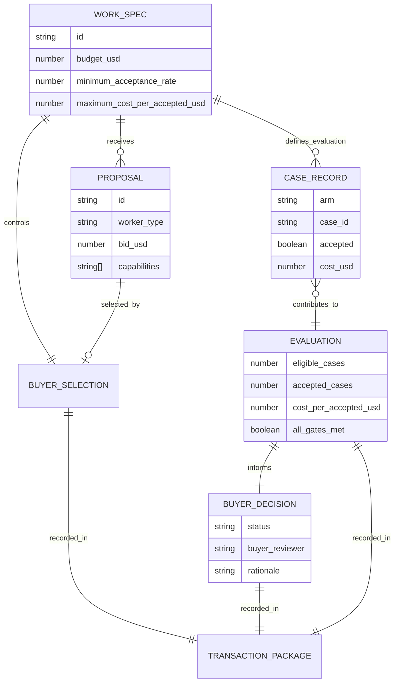
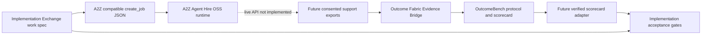
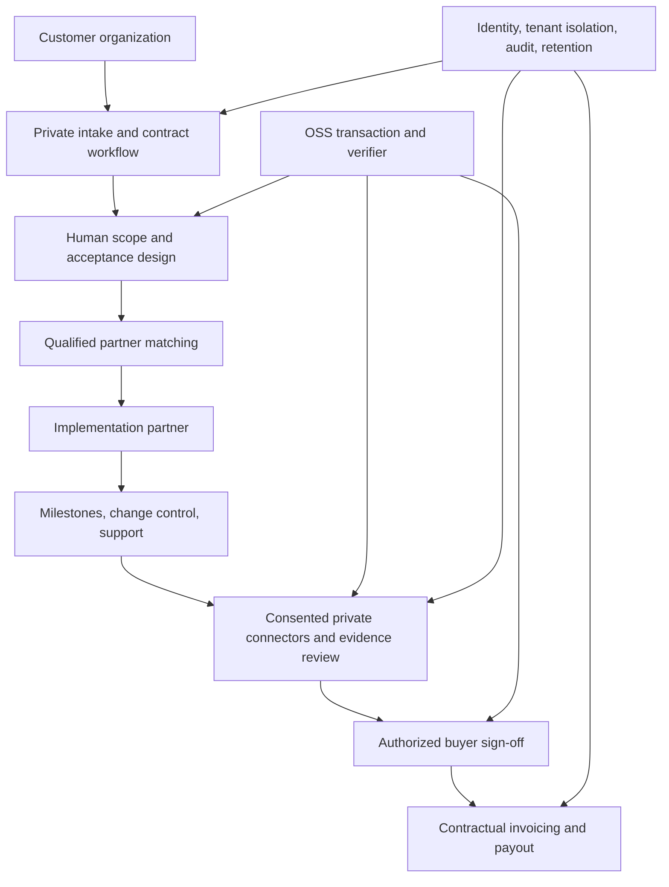

# Architecture and commercial boundary

## OSS reference system

The core is pure Python and JSON. It makes no network requests. A transaction is built from five source inputs; derived fields are never trusted on verification. The verifier reconstructs the package and compares canonical JSON byte-for-byte. That detects accidental or deliberate changes inside the package, but cannot authenticate independently supplied source records.

## Data and authority model

The work spec fixes evaluation thresholds before the cases are scored. Provider eligibility is checked before selection. Evaluation gates constrain acceptance but do not make the buyer's decision. The named reviewer is text in v0.1, so the reference runtime does not establish legal authority or nonrepudiation.

## Existing ecosystem integration

The current integration is a job payload matching A2Z Agent Hire's published `create_job` input fields. No live A2Z API call or OutcomeBench invocation is present. An OutcomeBench adapter should call OutcomeBench's own `verify(manifest, protocol, scorecard)` against original exports before mapping its metrics. Merely importing a JSON scorecard would be insufficient. The adapter must preserve its evidence class, comparison status, claim scope, and protocol hash, and refuse to convert descriptive results into a production recommendation.

## Prospective commercial product

The commercial layer would sell implementation coordination, qualified delivery capacity, private connectors, review operations, support and contractual administration. The inspectable work spec, evaluation arithmetic, acceptance schema and offline verifier should remain OSS so buyers and partners can independently inspect the basic transaction. Private customer data, verified partner records and negotiated contract terms belong in tenant-controlled systems; they are not an algorithmic secret or a pretext to hide the acceptance math.

## Unit-economics contract

For each real implementation, track buyer contract value, signed provider payout, model and compute expense, human review, integration work, support reserve, rework, payment fees, acquisition expense, collections and refunds. `contribution_margin = collected_revenue - provider_payout - variable_delivery_costs - payment_fees - expected_rework`. Gross margin should be computed only after those inputs are measured. Separately, report customer outcome economics as `total_recorded_workload_cost / accepted_resolutions` for the locked measurement window. Do not add the one-time implementation fee to per-case cost unless explicitly amortized over a declared case volume and horizon.

The synthetic example has $5,000 budget and $3,200 bid. The $1,800 remainder is not margin because there is no sale and the rest of the cost stack is unspecified. The supported claim is reproducible arithmetic on invented cases.
